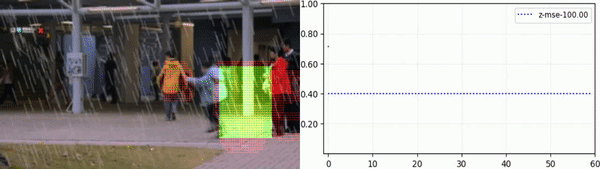

### Multi-branch Neural Network for Anomaly Detection in Adverse Lighting and Weather Conditions

This repository provides the implementation for our paper [**Multi-branch Neural Network for Anomaly Detection in Adverse Lightning and Weather Conditions** (Bo Li, Sam Leroux, and Pieter Simoens)](). We experimentally show that by making the background subtraction learnable and by adding multiple branches, we are better at detecting anomalies in scenes with varying visibility.


*Background interpolation on Nov-27-2020 in Brugge with view of the Market Square near the Belfry bell tower from the Olive Tree Restaurant*



*Detected anomalies on video sequence `testing_video_21` from the Avenue dataset with heavy rain under illumination 0.8 (left: most anomalous regions. right: anomalous score movement)*

#### Installation and data preparation
1. Clone this repo and prepare the environment
```
git clone https://gitlab.ilabt.imec.be/bobli/mbnn_ad.git
cd mbnn_ad
./requirement.sh
```
2. Prepare the dataset and download the model ckpts
```bash
./prepare_data.sh datadir augmentdata download_ckpt train_or_test rain bright
Args:
	datadir: the path to save the data, i.e., /project/anomaly_data/
	augmentdata: bool variable. true: augment the data
	download_ckpt: bool variable true: download the ckpt to folder checkpoints/
	train_or_test: str, training/testing
	rain: str, original/heavy/torrential, used when augmentdata is true
	bright: int, 1 to 10, used when augmentdata is true
Example:
./prepare_data.sh /project/anomaly_data/ true true testing heavy 8
```
#### Evaluate the model performance
```bash
./test_exp.sh version opt rain brightness datadir expdir modeltype data 
Args:
	version: int, experiment version 
	opt: str, test/fps/check_recons_pred
	rain: str, None/heavy/torrential
	brightness: int, the brightness value
	datadir: str, the path that saves the data
	expdir: str, the path that saves the model ckpts
	modeltype: str, single_branch/multi_branch_z
	data: str, avenue/avenue_robust_on_rain
Example:
	./test_exp.sh 0 fps None 0 /project/anomaly_data/ checkpoints/ single_branch avenue
Note:
	To evaluate the model, you first need to generate the dataset as explained in the previous step
```

#### Train the model
```bash
./run_exp.sh dataset model version 
Args:
	dataset: avenue/avenue_robust_on_rain
	model: single_branch/multi_branch_z
	version: int
	datadir: the path that saves the dataset 
	expdir: the path that saves the experiment
Example:
	./run_exp.sh avenue multi_branch_z 0 /project/anomaly_data/ checkpoints/
```

##### Credits
- https://www.skylinewebcams.com/en/webcam/belgique/flandres/bruges/markt.html
- https://github.com/UjjwalSaxena/Automold--Road-Augmentation-Library 